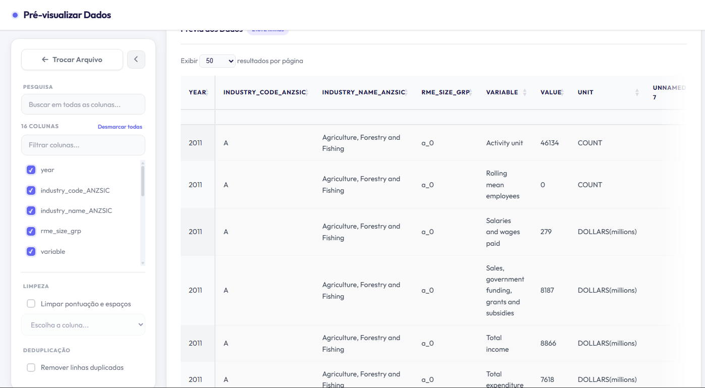

# 📊 Pré-visualizador e Filtrador de Dados



Uma ferramenta web moderna e eficiente para manipulação, visualização e exportação de planilhas. Desenvolvida com **Python (Flask)** e **Pandas**, oferece uma interface intuitiva para processar grandes volumes de dados diretamente no navegador.

---

## ✨ Funcionalidades

### 📂 Gestão de Arquivos
- **Upload Versátil:** Suporte para arquivos `.xlsx`, `.xls` e `.csv`.
- **Processamento Inteligente:** Carregamento otimizado para lidar com arquivos volumosos sem travar o navegador.
- **Exportação Flexível:**
  - Baixe o resultado filtrado em formato **Excel**.
  - Divida arquivos grandes em múltiplas partes e baixe como um **ZIP contendo CSVs**.

### 🔍 Filtragem e Edição
- **Seleção Dinâmica de Colunas:** Escolha exatamente quais colunas deseja visualizar e exportar.
- **Busca Global:** Filtro de texto em tempo real em todas as colunas simultaneamente.
- **Remoção de Duplicados:** Opção para eliminar linhas repetidas com um clique.
- **Limpeza de Dados:** Ferramenta para remover pontuações, espaços e caracteres especiais de colunas específicas ou de todo o arquivo.
- **Edição Inline:** Corrija valores diretamente na tabela com um clique duplo.

### 🖥️ Interface de Usuário (UX/UI)
- **Design Moderno:** Tema claro (Light Mode) limpo, baseado em estética SaaS premium.
- **Navegação de Colunas:** Pesquisa rápida dentro da lista de filtros para encontrar colunas em arquivos com centenas de campos.
- **Scroll Inteligente:** Sistema de navegação horizontal com sombras indicadoras e setas de rolagem suave para tabelas muito largas.
- **Sidebar Colapsável:** Ganhe mais espaço de tela ocultando os filtros lateralmente.
- **Paginação Customizada:** Controle total sobre a quantidade de linhas exibidas por página (até 1000 ou visualização total).

---

## 🚀 Tecnologias Utilizadas

### Backend
- **Python 3.x**
- **Flask:** Micro-framework web.
- **Pandas:** Biblioteca poderosa para manipulação e análise de dados.
- **OpenPyXL:** Motor para leitura/escrita de arquivos Excel.

### Frontend
- **HTML5 & CSS3:** Layout moderno com Glassmorphism e variáveis CSS.
- **JavaScript (Vanilla):** Lógica de interface e interações assíncronas (AJAX).
- **DataTables:** Processamento server-side para visualização de grandes datasets.
- **Font Awesome 6:** Iconografia profissional.
- **Google Fonts (Outfit):** Tipografia moderna e legível.

---

## 🛠️ Como Executar o Projeto

### Pré-requisitos
- Python instalado (recomendado 3.8+)
- Pip (gerenciador de pacotes do Python)

### Instalação

1. **Clone o repositório:**
   ```bash
   git clone https://github.com/seu-usuario/PreVisualizarDados-main.git
   cd PreVisualizarDados-main
   ```

2. **Crie um ambiente virtual (opcional mas recomendado):**
   ```bash
   python -m venv venv
   # No Windows:
   venv\Scripts\activate
   # No Linux/Mac:
   source venv/bin/activate
   ```

3. **Instale as dependências:**
   ```bash
   pip install -r requirements.txt
   ```

4. **Inicie a aplicação:**
   ```bash
   flask run
   ```

5. **Acesse no navegador:**
   O projeto estará disponível em `http://127.0.0.1:5000`

---

## 📁 Estrutura de Pastas

```text
├── app.py                # Servidor Flask e rotas principais
├── services/             # Lógica de processamento de dados (Pandas)
├── static/               # Ativos estáticos
│   ├── css/              # Estilos (Tema Claro/Moderno)
│   └── js/               # Lógica Frontend (DataTables, Filtros, AJAX)
├── templates/            # Páginas HTML (Jinja2)
├── uploads/              # Armazenamento temporário de arquivos enviados
├── requirements.txt      # Dependências do projeto
└── README.md             # Documentação
```

---

## 📝 Licença
Este projeto é de uso livre para fins de aprendizado e ferramentas internas.
